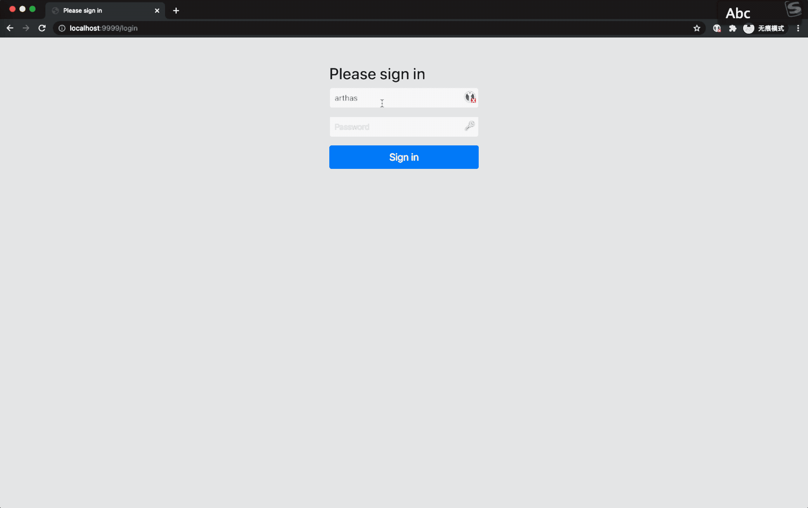

# arthas-ext

## 功能概述
在官方提供的`arthas-tunnel-server:arthas-tunnel-server`提供了以下功能的增强：
- 通过级联下拉框按`服务->实例`自动展示arthas agent列表，无需手动输入agentId进行连接；
- 基于Nacos动态配置实现的`用户->项目`的权限访问控制，可以动态添加修改用户、密码以及用户可以访问的项目访问；
- 支持代理连接模式，即：通过服务端转发代理连接到arthas agent;

## 功能说明

### arthas agent级联显示



### 权限控制
在nacos的配置管理中新建一条`dataId`=`application.yaml`,`group`=`arthas-tunnel-web`的配置，内容如下：
```yaml
arthas:
  tunnel:
    super-admin-role-sign: '*' #超级管理员的角色标志
    users:
      - name: arthas  #登录名
        password: 123456  #登录密码
        roles: ${arthas.tunnel.super-admin-role-sign}  #roles=${arthas.tunnel.super-admin-role-sign} 表示超级管理员,拥有查看所有app agent的权限
      - name: user1  #登录名
        password: 123456  #登录密码
        roles: #可以访问的项目列表
          - service-a
          - service-b
      - name: user2
        password: 123456
        roles:
          - service-b
```

### 代理模式
代理模式主要是为了解决当前浏览器与目标arthas agent的网络不通而无法访问arthas agent的问题，例如在目标服务部署在K8S环境中或要访问线上的服务

解决方式是通过tunnel server建立websocket代理（因为tunnel server与arthas agent的网络必定是通的），浏览器将websocket请求提交到tunnel server中，在tunnel server中做转发代理

websocket转发代理的实现位于`com.wf2311.arthas.tunnel.filter`包中，大部分代码移植于`SpringCloud Gateway`的`WebsocketRoutingFilter`的相关代码

### 应用名分隔符配置
为了从agentId中区分arthas agent的应用名，约定agentId的生成规则为 `<项目名>` + `<分隔符>` + `<随机字符串>` ，默认的分隔符为`@`，

也可以通过配置`arthas.agent.split`属性值来修改分隔符

## dynamic-arthas-spring-boot-starter
该模块只是在`com.taobao.arthas:arthas-spring-boot-starter`的基础上提供Arthas动态开关的效果

如果不需要动态开关功能也可以选择直接引用`com.taobao.arthas:arthas-spring-boot-starter`

详细说明参见[dynamic-arthas-spring-boot-starter](./dynamic-arthas-spring-boot-starter/README.md)

## 使用说明
本项目为实现动态权限控制的功能，依赖了nacos的配置管理，因此需要连接Nacos服务

具体参数配置可以参见[权限控制](#权限控制) 和[应用名分隔符配置](#应用名分隔符配置)

_特别说明：本项目不支持集群部署_

## 部署方式
### 本机调试
修改`bootstrap.yml`中的
- spring.cloud.nacos.config.server-addr
- spring.cloud.nacos.config.namespace  

启动项目

### docker启动

```shell
docker run -d -t  -p 9999:9999 -p 7777:7777 \
-v ~/logs/arthas-tunnel-web/:/application/logs \
-e JAVA_OPTS='-Xmx512m -Xms512m' \
-e SERVER_PORT='<本服务的启动端口，默认为9999>' \
-e TUNNEL_SERVER_PORT='<Tunnel Server的启动端口，默认为7777>' \
-e NACOS_ADDR='<nacos服务地址>' \
-e NACOS_NAMESPACE='<nacos命名空间>' \
--name arthas-tunnel-web wf2311/arthas-tunnel-web:latest
```

### docker-compose启动
```yml
version: "3"
services:
  arthas-tunnel-web:
    image: wf2311/arthas-tunnel-web:latest
    container_name: arthas-tunnel-web
    environment:
      - JAVA_OPTS=-Xmx256m -Xms256m
      - SERVER_PORT=<本服务的启动端口，默认为9999>
      - TUNNEL_SERVER_PORT=<Tunnel Server的启动端口，默认为7777>
      - NACOS_ADDR=<nacos服务地址>
      - NACOS_NAMESPACE='<nacos命名空间>'
    volumes:
      - ~/Share/logs/arthas-tunnel-web/:/application/logs
    ports:
      - "9999:9999"
      - "7777:7777"
```

### k8s部署脚本
```yml
apiVersion: apps/v1
kind: Deployment
metadata:
  name: arthas-tunnel-web
spec:
  replicas: 1
  selector:
    matchLabels:
      app: arthas-tunnel-web
  template:
    metadata:
      labels:
        app: arthas-tunnel-web
    spec:
      containers:
        - env:
            - name: SERVER_PORT
              value: '<本服务的启动端口，默认为9999>'
            - name: TUNNEL_SERVER_PORT
              value: '<Tunnel Server的启动端口，默认为7777>'
            - name: JVM_OPTS
              value: '-Xmx256m -Xms256m'
            - name: NACOS_ADDR
              value: '<nacos服务地址>'
            - name: NACOS_NAMESPACE
              value: '<nacos命名空间>'
          name: arthas-tunnel-web
          image: 'wf2311/arthas-tunnel-web:latest'
          imagePullPolicy: Always
          ports:
            - containerPort: <SERVER_PORT>
---
apiVersion: v1
kind: Service
metadata:
  name: arthas-tunnel-web
  namespace: support
spec:
  ports:
    - port: 9999
      targetPort: 9999
      name: arthas-tunnel-web
    - port: 7777
      targetPort: 7777
      name: arthas-tunnel-server
  selector:
    app: arthas-tunnel-web
  type: LoadBalancer

```

## 参考
1. [SpringBoot Admin集成Arthas实践](https://github.com/alibaba/arthas/issues/1601)
2. [SpringBoot Admin2.0集成Arthas实践](https://github.com/alibaba/arthas/issues/1736)


